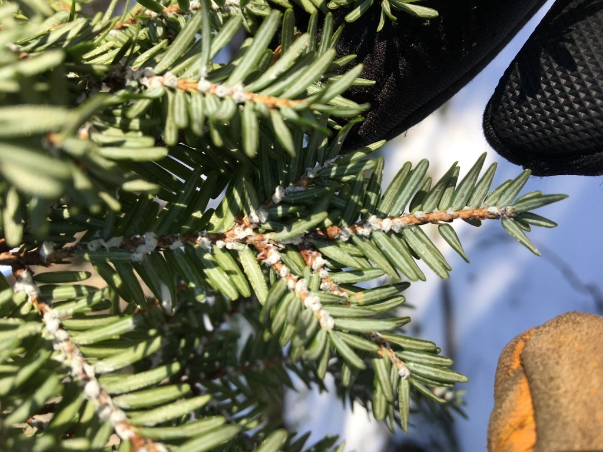
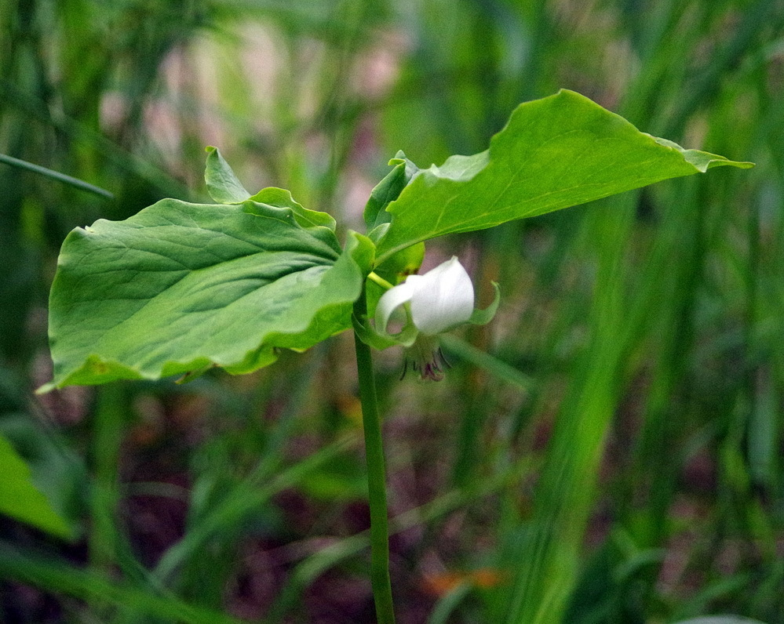
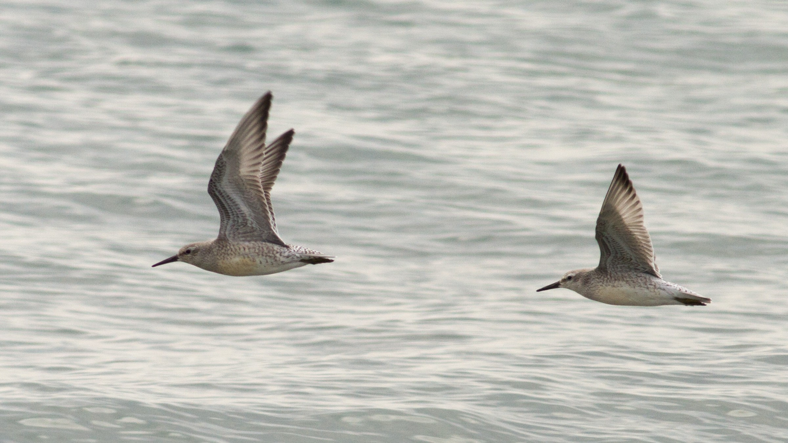

```{r setup, include = FALSE}

# Global options and library loading
knitr::opts_chunk$set(echo = FALSE, warning = FALSE, message = FALSE)
library(tidyverse)
library(lubridate)
library(kableExtra)
library(htmltools)
library(sf)
library(gt)
library(downloadthis)
library(DT)
source("email_alerts/email_functions.R")


start <- format(today() - 7, "%d %B %Y")
end <- format(today()-1, "%d %B %Y")


## Pull iNaturalist and eBird data
# inat <- inat_recent("17", "week")
# ebird <- ebird_recent("US-ME")


## Make a df with 'groups' to add to the data
# groups <- data.frame(iconic.taxon.name = c("Plantae", "Mammalia", "Animalia", "Aves", "Insecta",
#                                  "Reptilia", "Amphibia", "Fungi", "Protozoa", "Chromista",
#                                  "Arachnida", "Mullusca"),
#            groups = c("Plants", "Mammals", "Other animals", "Birds", "Insects", "Reptiles",
#                       "Amphibians", "Fungi and lichens", "Protozoans", "Kelp and seaweeds",
#                       "Spiders", "Mullusks"))


## Combine the two data frames
# final_data <- combine_citsci_data(
#   inat %>%
#     select(scientific.name, common.name, iconic.taxon.name, observed.on,
#            place.guess, latitude, longitude, positional.accuracy, user.login,
#            user.id, captive.cultivated, url, image.url, license, presv_name, polygonloc),
#   ebird %>%
#     select(scientific.name, common.name, iconic.taxon.name, count, observed.on,
#            place.guess, latitude, longitude, checklist, url, presv_name, polygonloc),
#   join = groups) %>%
#   rename(preserve = presv_name)


## Run the summary function on the final data
# watchlist_species(final_data, "email_alerts/outputs")


## Read in the outputs from the watchlist species functions and format for tables
## Removing buffer zone spp for rare and te species
pests <- process_species("email_alerts/outputs/invasive_pestslist.csv")
rare <- process_species("email_alerts/outputs/rare_specieslist.csv") %>%
  filter(polygonloc == "preserve") %>%
  select(-c(polygonloc))
te <- process_species("email_alerts/outputs/te_specieslist.csv",
                      extra_cols = "listing.status") %>%
  filter(polygonloc == "preserve") %>%
  select(-c(polygonloc))


## Add new records to the database
records <- bind_rows(
  if(nrow(read.csv("email_alerts/outputs/invasive_pestslist.csv")) > 0) {
    read.csv("email_alerts/outputs/invasive_pestslist.csv")
  },

  if(nrow(read.csv("email_alerts/outputs/rare_specieslist.csv")) > 0) {
    read.csv("email_alerts/outputs/rare_specieslist.csv")
  },

  if(nrow(read.csv("email_alerts/outputs/te_specieslist.csv")) > 0) {
    read.csv("email_alerts/outputs/te_specieslist.csv")
  }
)

database <- bind_rows(read.csv("email_alerts/outputs/database_records.csv"),
                      records) %>%
  arrange(desc(polygonloc), preserve, observed.on) %>%
  write.csv(., "email_alerts/outputs/database_records.csv", row.names = F)


## Combine for map
pestsmap <- read.csv("email_alerts/outputs/invasive_pestslist.csv") %>%
  select(scientific.name, common.name, latitude, longitude, url)
raremap <- read.csv("email_alerts/outputs/rare_specieslist.csv") %>%
  filter(polygonloc == "preserve") %>%
  select(scientific.name, common.name, latitude, longitude, url)
temap <- read.csv("email_alerts/outputs/te_specieslist.csv") %>%
  filter(polygonloc == "preserve") %>%
  select(scientific.name, common.name, latitude, longitude, url)
mapcomb <- rbind(pestsmap, raremap, temap)

  
```


<!-- Top Button -->
<a href = "#"></a>


<!-- Header -->
<div class = "title-box">
  <div class = "title-text-box">
  <!-- Title -->
  <div class = "h1 header-text">
  Saguaro National Park Managers' Report
  </div>
  <div class = "h2 header-text">
  A citizen science early-detection tool
  </div>
  <!-- Intro paragraph -->
  <div class = "headerp"> 
  Welcome to the weekly early detection report of observations submitted by iNaturalist and eBird users. These are all observations submitted over the past week for species that Saguaro National Park managers have identified as being of conservation interest. These data for this report comes from two of the largest open source citizen science projects: iNaturalist and eBird. The records included in this report include both casual and research grade observations, so erroneous identifications are possible. Managers should double check the identification of species to ensure they are correct.
  </div>
  <!-- Dates -->
  <div class = "header-date"> 
  `r start` - `r end`
  </div>
  </div>
</div>


<!-- #### All Things Body ##### -->
<div class = "thebody">


<!-- Observations Map -->
<div class = "map-box">
  <div>
  <h3 class = "boxtitles titlemap"> Explore Species Locations </h3>
  `r leaflet_summary(mapcomb)`
  </div>
</div>


<!-- Invasive Species -->
<div class = "species-box">
  <div>
  <h3 class = "boxtitles"> Invasive Species </h3>
  </div>
  
  <h5 class = "cite"> © Jesse Wheeler </h5>
  <div class = "sp-table shrink-table">
```{r pests-table, results = 'asis', echo = FALSE}
pesttab <- pests %>%
  filter(polygonloc == "preserve") %>% 
  select(-c(latitude, longitude, polygonloc))

if (nrow(pesttab) > 0) {
  
  DT::datatable(
    pesttab,
    options = list(
      dom = 't',
      pageLength = -1,
      autoWidth = TRUE),
    rownames = FALSE,
    escape = FALSE,
    filter = "top",
    colnames = c("Scientific Name", "Common Name", "Date Observed", "Preserve", "Link"))
} else {
  cat(HTML("<h3>There were no invasive species reported this week.</h3>"))
}
```
  </div>
</div>


<!-- Rare Species -->
<div class = "species-box">
  <div>
  <h3 class = "boxtitles"> Rare Species </h3>
  </div>
  
  <h5 class = "cite cite-white"> © Andy Fyon </h5>
  <div class = "sp-table shrink-table">
```{r rare-table, results = 'asis', echo = FALSE}
if (nrow(rare) > 0) {
  raretab <- rare %>%
    select(-c(latitude, longitude))
  
  DT::datatable(
    raretab,
    options = list(
      dom = 't',
      pageLength = -1,
      autoWidth = TRUE),
    rownames = FALSE,
    escape = FALSE,
    filter = "top",
    colnames = c("Scientific Name", "Common Name", "Date Observed", "Preserve", "Link"))
} else {
  cat(HTML("<h3>There were no rare species reported this week.</h3>"))
}
```
  </div>
</div>


<!-- Threatened & Endangered Species -->
<div class = "species-box">
  <div>
  <h3 class = "boxtitles"> Threatened & Endangered Species </h3>
  </div>
  
  <h5 class = "cite"> © Fyn Kynd </h5>
  <div class = "sp-table shrink-table">
```{r te-table, results = 'asis', echo = FALSE}
if (nrow(te) > 0) {
  tetab <- te %>%
    select(-c(latitude, longitude)) %>% 
    select(scientific.name:observed.on, listing.status, preserve, link)
  
  DT::datatable(
    tetab,
    options = list(
      dom = 't',
      pageLength = -1,
      autoWidth = TRUE),
    rownames = FALSE,
    escape = FALSE,
    filter = "top",
    colnames = c("Scientific Name", "Common Name", "Date Observed", "Preserve", "Listing", "Link"))
} else {
  cat(HTML("<h3>There were no threatened or endangered species reported this week.</h3>"))
}
```
  </div>
</div>


<!-- Buffer Zone Species -->
<div class = "species-box">
  <div>
  <h3 class = "boxtitles"> Buffer Zone Species </h3>
  </div>
  
  <h5 class = "cite"> © Kyle Lima </h5>
  <div class = "sp-table shrink-table">
```{r buffer-table, results = 'asis', echo = FALSE}
bufftab <- pests %>%
  filter(polygonloc == "buffer") %>% 
  filter(common.name != "rugosa rose") %>% 
  select(-c(latitude, longitude, polygonloc))

if (nrow(bufftab) > 0) {
  
  DT::datatable(
    bufftab,
    options = list(
      dom = 't',
      pageLength = -1,
      autoWidth = TRUE),
    rownames = FALSE,
    escape = FALSE,
    filter = "top",
    colnames = c("Scientific Name", "Common Name", "Date Observed", "Preserve", "Link"))
} else {
  cat(HTML("<h3>There were no species reported from the buffer zone this week.</h3>"))
}
```
  </div>
</div>


<!-- Download -->
<div class = "species-box">
  <div>
  <h3 class = "boxtitles"> Download Previous Records </h3>
  </div>
  <div class = "dlb">
``` {r echo = FALSE}
read.csv("email_alerts/outputs/database_records.csv") %>%
  download_this(
    output_name = "full_MCHT_watchlist_database",
    output_extension = ".xlsx",
    button_label = "Download park data",
    button_type = "success")
```
  </div>
</div>

</div>


<!-- Footer -->
<div class = "footer-box">
<div class = "footer-content">
<div class = "footer-si">
  
  <p><i>Our Mission is inspiring science, learning, and community for a changing world.</i></p>
</div>
<div>
  <h2>ABOUT</h2>
  <p><a href = "https://github.com/Kylelima21/MCHT_early_detection_system" target="_blank">Source code</a></p>
  <p><a href = "https://www.nps.gov/sagu/index.htm" target = "_blank">Visit Saguaro National Park</a></p>
  <p><a href = "https://friendsofsaguaro.org/" target = "_blank">Visit the Friends of Saguaro National Park website</a></p>
  <p><a href = "https://schoodicinstitute.org/" target = "_blank">Visit the Schoodic Institute website</a></p>
</div>
<div>
  <h2>CONTACT</h2>
  <p>Contact us at klima@schoodicinstitute.org</p>
</div>
</div>
<div class = "copyright">
  <p>&copy; `r format(Sys.Date(), "%Y")` Schoodic Institute</p>
</div>
